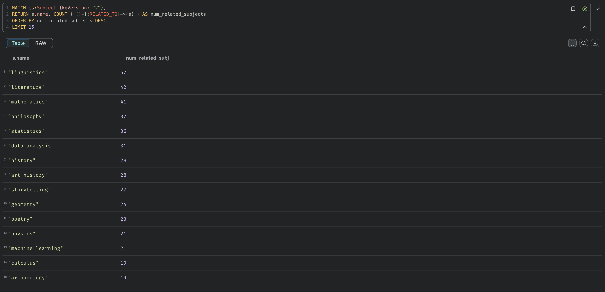
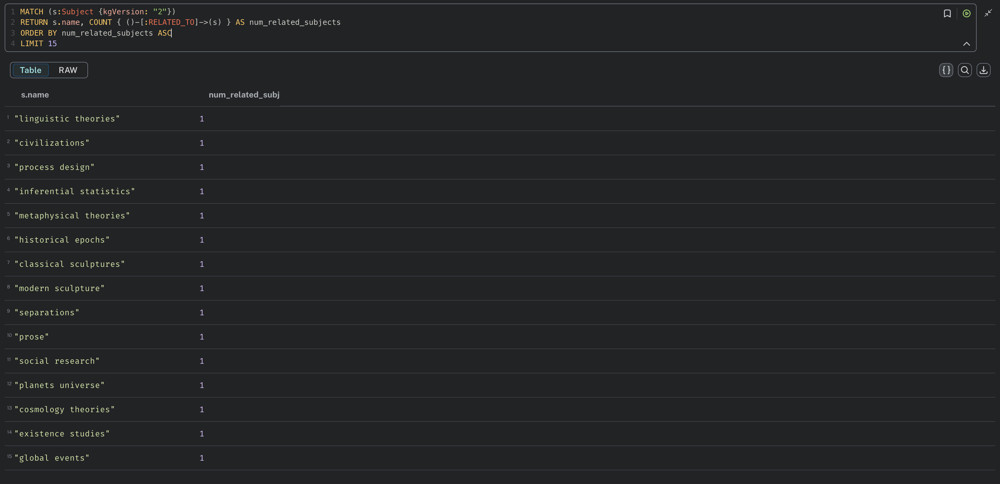
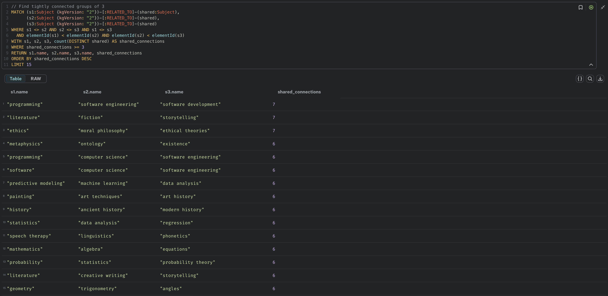

# llmkg
Exploration of using LLMs to create knowledge graphs

## Requirements
- go 1.24+
- python 3.10+
- uv
- docker
- make
- httpie

## How to use

Spin up the application with `make up`

This will start:
- The [API server](http://127.0.0.1:8000/ping) on port `8000`
- The Neo4j database on port `7687` (bolt protocol)
- The [Neo4j browser](http://127.0.0.1:7474) on port `7474`

Build a knowledge graph with the Python CLI by following the instructions in the
[scripts/README.md](scripts/README.md) file.

This will populate the Neo4j database with the initial subjects and then progressively populate the
database with more related subjects. An OpenAI API key is required to run the script.

Cypher queries can be run in the Neo4j browser [here](http://localhost:7474/browser/preview/).

Example query showing all subjects and their related subjects:
```cypher
MATCH (s1:Subject {kgVersion: "1"})
OPTIONAL MATCH (s1)-[r:RELATED_TO]-(s2:Subject)
RETURN s1, r, s2
```

Spin down the application with `make down`

## Learnings

### The most general subjects tend to be the ones most referenced as a related subject, but this is not always the case.
```cypher
MATCH (s1:Subject {kgVersion: "2"})
RETURN s1.name, COUNT { (s1)-[:RELATED_TO]->(s2) } AS num_related_subjects
ORDER BY num_related_subjects DESC
LIMIT 15
```
Querying for subjects with the most related subject references:


### The most specific subjects tend to be the ones with the least related subjects.
```cypher
MATCH (s1:Subject {kgVersion: "2"})
RETURN s1.name, COUNT { (s1)-[:RELATED_TO]->(s2) } AS num_related_subjects
ORDER BY num_related_subjects ASC
LIMIT 15
```
Querying for subjects with the least related subject references:


### Groups of connected subjects can be queried for.
```cypher
// Find tightly connected groups of 3
MATCH (s1:Subject {kgVersion: "2"})-[:RELATED_TO]-(shared:Subject),
      (s2:Subject {kgVersion: "2"})-[:RELATED_TO]-(shared),
      (s3:Subject {kgVersion: "2"})-[:RELATED_TO]-(shared)
WHERE s1 <> s2 AND s2 <> s3 AND s1 <> s3
  AND elementId(s1) < elementId(s2) AND elementId(s2) < elementId(s3)
WITH s1, s2, s3, count(DISTINCT shared) AS shared_connections
WHERE shared_connections >= 3
RETURN s1.name, s2.name, s3.name, shared_connections
ORDER BY shared_connections DESC
LIMIT 20
```

This query can be expanded as follows:
```cypher
// Find tightly connected groups of 5 subjects with shared neighbors
MATCH (s1:Subject {kgVersion: "2"})-[:RELATED_TO]-(shared:Subject),
      (s2:Subject {kgVersion: "2"})-[:RELATED_TO]-(shared),
      (s3:Subject {kgVersion: "2"})-[:RELATED_TO]-(shared),
      (s4:Subject {kgVersion: "2"})-[:RELATED_TO]-(shared),
      (s5:Subject {kgVersion: "2"})-[:RELATED_TO]-(shared)
WHERE s1 <> s2 AND s1 <> s3 AND s1 <> s4 AND s1 <> s5
  AND s2 <> s3 AND s2 <> s4 AND s2 <> s5
  AND s3 <> s4 AND s3 <> s5
  AND s4 <> s5
  AND elementId(s1) < elementId(s2)
  AND elementId(s2) < elementId(s3)
  AND elementId(s3) < elementId(s4)
  AND elementId(s4) < elementId(s5)
WITH s1, s2, s3, s4, s5, count(DISTINCT shared) AS shared_connections
WHERE shared_connections >= 3
RETURN s1.name, s2.name, s3.name, s4.name, s5.name, shared_connections
ORDER BY shared_connections DESC
LIMIT 20
```

## Potential improvements

See notes [here](./NOTES/IDEAS.txt) for potential improvements.

## TODO

- [ ] BUGS:
    - [ ] Subject special characters are not escaped before insertion into the database
- [ ] Update population script to expose CLI options for:
    - [ ] KG version
    - [ ] Number of related subjects to fetch per subject
    - [ ] Max Subject count
- [ ] Create a few more knowledge graph versions
- [ ] See if the clustering is similar for each KG version
- [ ] Iterate on LLM prompt
    - [ ] Have it only get progressively more specific as it goes deeper
    - [ ] Have it return some parent and some children
